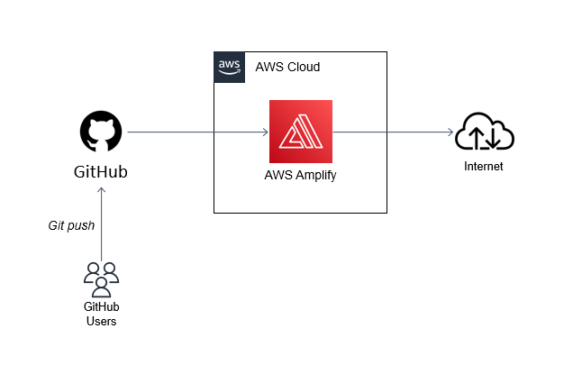
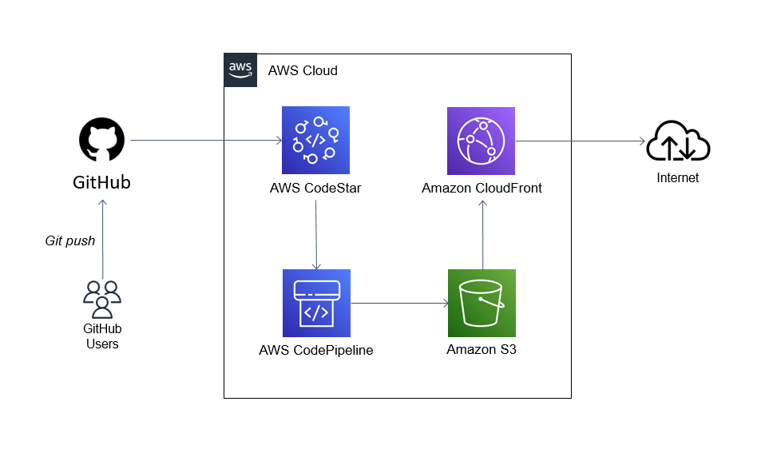
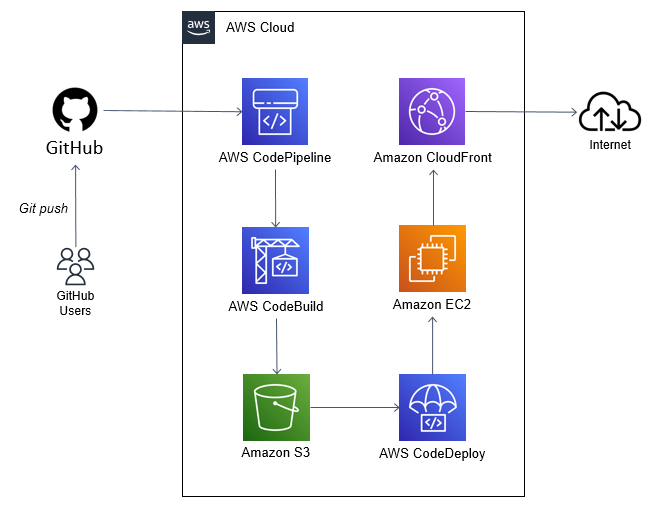

# AWS Handbook for SAA-C03 Certification

## About
Welcome to the AWS Handbook for SAA-C03 certification, an open-source guide designed to help you prepare for the AWS Certified Solutions Architect - Associate exam. This handbook includes detailed AWS service information with a convenient search feature. While some content is generated using GitHub Copilot, it has been thoroughly reviewed for accuracy and clarity. For corrections or suggestions, please open an issue or submit a pull request.

## Status

- ~~[x] Development stage hosted on Netlify~~
- ~~[x] Production stage hosted on AWS~~
- ~~[x] Custom domain name~~

## AWS Hosting Solutions
This section outlines key AWS services for website hosting, featuring service descriptions and architectural diagrams. Note: Details on AWS Route 53, VPC, and IAM are excluded as they are indirect to hosting but can be used for domain management, network creation, and user permissions, respectively.

### AWS Amplify
AWS Amplify offers a full-stack development platform for both backend and frontend, facilitating scalable, secure, and high-performance applications. It integrates CloudFront to distribute content globally, enhancing application performance and security against DDoS attacks without manual CloudFront configuration.



### Amazon S3 + CloudFront
Host a static website using Amazon S3 along with CloudFront, optimized by:
- GitHub
- AWS CodeStar
- AWS CodePipeline
- Amazon S3
- Amazon CloudFront



### EC2 Deployment
Deploy a React.js application on EC2, supported by:
- GitHub
- AWS CodePipeline
- AWS CodeBuild
- AWS CodeDeploy
- Amazon EC2
- Amazon CloudFront




For application hosting you can also choose to use AWS Elastic Beanstalk, AWS OpsWorks, or AWS Elastic Container Service (ECS). For more information, see [AWS Application Hosting](https://docs.aws.amazon.com/whitepapers/latest/aws-overview/application-hosting.html).
### Installation

```
$ yarn
```

### Local Development

```
$ yarn start
```

This command starts a local development server and opens up a browser window. Most changes are reflected live without having to restart the server.

### Build

```
$ yarn build
```

This command generates static content into the `build` directory and can be served using any static contents hosting service.

### Deployment

Using SSH:

```
$ USE_SSH=true yarn deploy
```

Not using SSH:

```
$ GIT_USER=<Your GitHub username> yarn deploy
```

If you are using GitHub pages for hosting, this command is a convenient way to build the website and push to the `gh-pages` branch.
